# Rate-Limit-Guard

一款适配海外社交业务的可插拔网关中间件，集成多级限流、IP 风控、时区解析、GDPR 请求脱敏，可无缝接入 go-zero 网关层。

## 特性

- **滑动窗口限流** — 基于 Redis ZSET 实现，三级角色：游客（严格）、登录用户（宽松）、管理员（绕过）
- **IP 风控** — 国家风险等级评估、自动临时黑名单（超过 N 次触发封禁）、白名单支持
- **时区解析** — 从 `X-Timezone` 请求头读取客户端时区，存入 Context 供下游 RPC 服务使用
- **GDPR 脱敏** — 对 Authorization / Email / Device-ID 等敏感 Header 做掩码处理，日志不泄露明文
- **Prometheus 埋点** — 内置限流命中数 / 拦截请求数 / 黑名单大小计数器
- **go-zero 原生适配** — 标准 `rest.Middleware` 签名，一行代码接入 Gateway

## 项目结构

```
rate-limit-guard/
├── guard.go                    # Guard 主结构、NewGuard / NewGuardWithRedis
├── config.go                   # 顶层 Config（组合子包配置）
├── middleware.go                # go-zero rest.Middleware 适配层
├── context.go                  # Context 存取：Role / Timezone / Region
├── metrics.go                  # Prometheus 计数器
│
├── limiter/
│   ├── config.go               # limiter.Config（窗口、阈值、管理绕过）
│   └── sliding_window.go       # SlidingWindowLimiter + Role
│
├── iprisk/
│   ├── config.go               # iprisk.Config（封禁时长、失败次数、白名单）
│   ├── ip_risk.go              # IPRisk — 国家风险 + 白名单
│   └── blacklist.go            # Blacklist — Redis 临时黑名单
│
├── privacy/
│   ├── config.go               # privacy.Config（时区 Header、敏感字段）
│   ├── gdpr.go                 # Sanitizer — Bearer/Email/DeviceID 掩码
│   └── timezone.go             # TimezoneParser — 时区解析
│
├── config.yaml                 # 默认配置文件
├── docker-compose.yml          # Redis 7-alpine 测试环境
├── Makefile
├── .gitignore
└── README.md
```

## 架构

```
请求 → Privacy 中间件 → IP Risk 中间件 → Rate Limit 中间件 → 上游服务
       (脱敏+时区)      (黑名单+国家风险)    (滑动窗口)
```

每个中间件可独立使用：

| 函数 | 模块 | 功能 |
|------|------|------|
| `PrivacyMiddleware()` | gdpr + timezone | 敏感 Header 脱敏 + 时区解析 |
| `IPRiskMiddleware()` | ip_risk + blacklist | 黑名单检查 + IP 风险评估 |
| `RateLimitMiddleware()` | sliding_window | 按角色执行限流 |
| `Middleware()` | 全部 | 全链路：privacy → iprisk → ratelimit |

## 快速开始

```go
import guard "github.com/Vierblatt/rate-limit-guard"

func main() {
    cfg := guard.Config{
        Limiter: guard.LimiterConfig{
            RedisAddr:  "localhost:6379",
            GuestLimit: 30,
            UserLimit:  100,
        },
    }
    g := guard.NewGuard(cfg)

    // go-zero Gateway
    gw := gateway.MustNewServer(gatewayConf,
        gateway.WithMiddleware(g.Middleware()),
    )
    gw.Start()
}
```

## 配置

参考 [`config.yaml`](./config.yaml)：

| 字段 | 默认值 | 说明 |
|------|--------|------|
| `Limiter.WindowSec` | `60` | 滑动窗口大小（秒） |
| `Limiter.GuestLimit` | `30` | 游客每窗口限制次数 |
| `Limiter.UserLimit` | `100` | 登录用户每窗口限制次数 |
| `Limiter.AdminBypass` | `true` | 管理员是否跳过限流 |
| `IPRisk.Enabled` | `true` | 启用 IP 风控 |
| `IPRisk.BlacklistTTL` | `10` | 黑名单封禁时长（分钟） |
| `IPRisk.MaxFails` | `3` | 触发黑名单的失败次数 |
| `IPRisk.HighRiskCountries` | `[RU, UA, NG, BD, PK, VN, ID]` | 高风险国家代码 |
| `Privacy.Enabled` | `true` | 启用 Header 脱敏 |
| `Privacy.SensitiveHeaders` | `[Authorization, Email, Device-Id, X-Device-Id]` | 需脱敏的 Header |
| `Privacy.TimezoneHeader` | `X-Timezone` | 客户端时区 Header |

从文件加载：

```go
cfg := guard.MustLoadConfig("config.yaml")
g := guard.NewGuard(*cfg)
```

## Context 值

| 函数 | 类型 | 说明 |
|------|------|------|
| `GetRole(ctx)` | `Role` | 当前角色：Guest / User / Admin |
| `GetTimezone(ctx)` | `*time.Location` | 客户端时区（默认 UTC） |
| `GetRegion(ctx)` | `string` | 客户端 IP / 地区标识 |
| `GetSanitizedHeaders(ctx)` | `http.Header` | GDPR 脱敏后的 Header 副本 |

## 角色判定

| 角色 | Header | 说明 |
|------|--------|------|
| 游客 | 无 | 匿名用户，最严格限流 |
| 登录用户 | `X-User-Id` | 经过认证的用户 |
| 管理员 | `X-Admin` | 跳过限流 |

## 性能

测试环境：Docker Redis 7-alpine (localhost), Intel i9-14900HX, Go 1.26.1。

```
BenchmarkMiddlewares/Privacy-32         25992     54.1 µs/op   48943 B/op     39 allocs/op
BenchmarkMiddlewares/IPRisk-32          26209     49.4 µs/op    6582 B/op     39 allocs/op
BenchmarkMiddlewares/RateLimit-32       22108     54.8 µs/op    7463 B/op     57 allocs/op
BenchmarkMiddlewares/All-32             11424    106.4 µs/op   50826 B/op     71 allocs/op
```

全链路 ~106 µs，瓶颈在 HTTP Header 解析而非 Redis。

```mermaid
gantt
    title 请求处理耗时分解 (P50)
    dateFormat X
    axisFormat %s µs

    section 中间件全链路
    Header 解析 + 时区             :active, a1, 0, 20
    GDPR 脱敏                      :active, a2, 20, 54
    IP 风控 (Redis EXISTS)        :active, a3, 54, 76
    滑动窗口限流 (Redis Lua)      :active, a4, 76, 88
    上下文组装 + 响应             :active, a5, 88, 106
```



> 运行 `make bench-real` 复现。

## 测试

```bash
make test        # 全部测试（miniredis，零外部依赖）
make bench       # 快速 benchmark（miniredis）
make bench-real  # benchmark 走真实 Redis ↓
                 #   docker-compose up → 跑 → down

make up          # docker-compose up -d
make down        # docker-compose down
```

## License

MIT
