# Rate-Limit-Guard

A pluggable gateway middleware for overseas social platforms, integrating multi-level rate limiting, IP risk control, timezone parsing, and GDPR request sanitization. Seamlessly integrates with the go-zero gateway.

## Features

- **Sliding Window Rate Limiting** — Redis-based sliding window with three tiers: guest (strict), user (moderate), admin (bypass)
- **IP Risk Control** — Country-based risk evaluation, automatic temp blacklisting after N violations, whitelist support
- **Timezone Parsing** — Reads client timezone from `X-Timezone` header, stores in context for downstream RPC services
- **GDPR Request Sanitization** — Masks sensitive headers (Authorization, Email, Device-ID) for log compliance
- **Prometheus Metrics** — Built-in counters for rate limit hits, blocked requests, blacklist size
- **go-zero Compatible** — Standard `rest.Middleware` signature, one-liner gateway integration

## Project Structure

```
rate-limit-guard/
├── guard.go              # Guard struct, NewGuard / NewGuardWithRedis
├── config.go             # Config, LimiterConfig, IPRiskConfig, PrivacyConfig
├── config.yaml           # Default configuration file
│
├── sliding_window.go     # Redis ZSET sliding window limiter (guest/user/admin)
├── ip_risk.go            # Country-based risk evaluation + whitelist
├── blacklist.go          # Redis-backed temp blacklist (auto-ban after N fails)
│
├── gdpr.go               # Header sanitization (Bearer, Email, Device-ID masking)
├── timezone.go           # Timezone parser from X-Timezone header
│
├── middleware.go          # go-zero rest.Middleware adapters (4 entry points)
├── context.go            # Context helpers: GetRole, GetTimezone, GetRegion
├── metrics.go            # Prometheus counters (promauto, auto-registered)
│
├── *_test.go             # Unit tests + integration tests + benchmarks
├── redis_test_helper.go  # Test helper: miniredis based, no external Redis needed
│
├── docker-compose.yml    # Redis 7-alpine for local testing
├── Makefile              # test / bench / coverage / up / down
├── .gitignore
└── README.md
```

## Architecture

```
Request → Privacy Middleware → IP Risk Middleware → Rate Limit Middleware → Upstream
           (sanitize+PII)      (blacklist+GeoIP)     (sliding window)
```

Each middleware is independently usable via `g.PrivacyMiddleware()`, `g.IPRiskMiddleware()`, `g.RateLimitMiddleware()`, or combined via `g.Middleware()`.

### Middleware Entry Points

| Function | Modules | Description |
|----------|---------|-------------|
| `PrivacyMiddleware()` | gdpr + timezone | Sanitize sensitive headers, parse client timezone |
| `IPRiskMiddleware()` | ip_risk + blacklist | Check blacklist, evaluate IP risk |
| `RateLimitMiddleware()` | sliding_window | Enforce per-role rate limits |
| `Middleware()` | all | Full pipeline: privacy → iprisk → ratelimit |

## Quick Start

```go
import guard "github.com/c4rb0n/rate-limit-guard"

func main() {
    cfg := guard.Config{
        Limiter: guard.LimiterConfig{
            RedisAddr:  "localhost:6379",
            GuestLimit: 30,
            UserLimit:  100,
        },
    }
    g := guard.NewGuard(cfg)

    // go-zero Gateway
    gw := gateway.MustNewServer(gatewayConf,
        gateway.WithMiddleware(g.Middleware()),
    )
    gw.Start()
}
```

## Configuration

See [`config.yaml`](./config.yaml) for defaults:

| Field | Default | Description |
|-------|---------|-------------|
| `Limiter.RedisAddr` | `localhost:6379` | Redis address |
| `Limiter.WindowSec` | `60` | Sliding window (seconds) |
| `Limiter.GuestLimit` | `30` | Requests/window for guests |
| `Limiter.UserLimit` | `100` | Requests/window for users |
| `Limiter.AdminBypass` | `true` | Skip rate limiting for admins |
| `IPRisk.Enabled` | `true` | Enable IP risk evaluation |
| `IPRisk.BlacklistTTL` | `10` | Blacklist duration (minutes) |
| `IPRisk.MaxFails` | `3` | Failures before blacklisting |
| `IPRisk.HighRiskCountries` | `[RU, UA, NG, BD, PK, VN, ID]` | High-risk country codes |
| `Privacy.Enabled` | `true` | Enable header sanitization |
| `Privacy.SensitiveHeaders` | `[Authorization, Email, Device-Id, X-Device-Id]` | Headers to mask |
| `Privacy.TimezoneHeader` | `X-Timezone` | Header for client timezone |

Load from file:

```go
cfg := guard.MustLoadConfig("config.yaml")
g := guard.NewGuard(*cfg)
```

## Context Values

| Function | Type | Description |
|----------|------|-------------|
| `GetRole(ctx)` | `Role` | `RoleGuest`, `RoleUser`, or `RoleAdmin` |
| `GetTimezone(ctx)` | `*time.Location` | Parsed client timezone (default UTC) |
| `GetRegion(ctx)` | `string` | Client IP / region identifier |
| `GetSanitizedHeaders(ctx)` | `http.Header` | GDPR-masked headers |

## Role Detection

| Role | Header | Description |
|------|--------|-------------|
| Guest | (none) | Anonymous users, strictest limits |
| User | `X-User-Id` | Authenticated users |
| Admin | `X-Admin` | Bypasses rate limiting |

## Benchmarks

```
BenchmarkMiddlewares/Privacy-32      16947    77.9 µs/op   51105 B/op     93 allocs/op
BenchmarkMiddlewares/IPRisk-32       17888    64.1 µs/op   10178 B/op    115 allocs/op
BenchmarkMiddlewares/RateLimit-32     4056   404.5 µs/op  276730 B/op    914 allocs/op
BenchmarkMiddlewares/All-32           1648   898.0 µs/op  425816 B/op    968 allocs/op
```

Full middleware pipeline completes in <1ms per request. The rate limiter allocates more due to Redis Lua script execution.

```mermaid
gantt
    title 请求处理耗时分解 (P50)
    dateFormat X
    axisFormat %s µs

    section 中间件全链路
    请求入站 (Header 解析)        :active, a1, 0, 80
    GDPR 脱敏 + 时区解析          :active, a2, 80, 160
    IP 风控 (Redis EXISTS)       :active, a3, 160, 230
    滑动窗口限流 (Redis Lua)     :active, a4, 230, 630
    响应回写                     :active, a5, 630, 720
    其他开销                     :active, a6, 720, 900
```



## Testing

```bash
# Start Redis (optional—tests fall back to miniredis automatically)
docker-compose up -d

# Run all tests
make test

# Run benchmarks
make bench
```

## License

MIT
