# Rate-Limit-Guard

一款适配海外社交业务的可插拔网关中间件，集成多级限流、IP 风控、时区解析、GDPR 请求脱敏，可无缝接入 go-zero 网关层。

[](https://github.com/Vierblatt/rate-limit-guard/actions/workflows/ci.yml)

## 特性

- **滑动窗口限流** — 基于 Redis ZSET 实现，三级角色：游客（严格）、登录用户（宽松）、管理员（绕过）
- **IP 风控** — 国家风险等级评估并收紧配额、自动临时黑名单（超过 N 次触发封禁）、白名单支持
- **时区解析** — 从 `X-Timezone` 请求头读取客户端时区，存入 Context 供下游 RPC 服务使用
- **GDPR 脱敏** — 对 Authorization / Email / Device-ID 等敏感 Header 做掩码处理，日志不泄露明文
- **Prometheus 埋点** — 内置限流命中数 / 拦截请求数 / 黑名单大小计数器
- **go-zero 原生适配** — 标准 `rest.Middleware` 签名，一行代码接入 Gateway

## 项目结构

```
rate-limit-guard/
├── guard.go                    # Guard 主结构、NewGuard / NewGuardWithRedis
├── config.go                   # 顶层 Config（组合子包配置）
├── middleware.go                # go-zero rest.Middleware 适配层
├── context.go                  # Context 存取：Role / Timezone / Region / Country
├── metrics.go                  # Prometheus 计数器
│
├── limiter/
│   ├── config.go               # limiter.Config（窗口、阈值、管理绕过）
│   └── sliding_window.go       # SlidingWindowLimiter + Role
│
├── iprisk/
│   ├── config.go               # iprisk.Config（封禁时长、失败次数、风险配额、白名单）
│   ├── ip_risk.go              # IPRisk — 国家风险 + 配额缩放 + 白名单
│   └── blacklist.go            # Blacklist — Redis 临时黑名单
│
├── privacy/
│   ├── config.go               # privacy.Config（时区 Header、敏感字段）
│   ├── gdpr.go                 # Sanitizer — Bearer/Email/DeviceID 掩码
│   └── timezone.go             # TimezoneParser — 时区解析
│
├── .github/workflows/ci.yml    # CI：gofmt + vet + test -race + 覆盖率门禁
├── config.yaml                 # 默认配置文件
├── docker-compose.yml          # Redis 7-alpine 测试环境
├── Makefile
├── .gitignore
└── README.md
```

## 架构

```
请求 → Privacy 中间件 → IP Risk 中间件 → Rate Limit 中间件 → 上游服务
       (脱敏+时区)      (黑名单+国家风险)    (滑动窗口×风险配额)
```

每个中间件可独立使用：

| 函数 | 模块 | 功能 |
|------|------|------|
| `PrivacyMiddleware()` | gdpr + timezone | 敏感 Header 脱敏 + 时区解析 |
| `IPRiskMiddleware()` | ip_risk + blacklist | 黑名单检查 + IP 风险评估 |
| `RateLimitMiddleware()` | sliding_window | 按角色执行限流 |
| `Middleware()` | 全部 | 全链路：privacy → iprisk → ratelimit |

## 快速开始

```go
import guard "github.com/Vierblatt/rate-limit-guard"

func main() {
    cfg := guard.Config{
        RedisAddr: "localhost:6379",
        Limiter: limiter.Config{
            WindowSec:  60,
            GuestLimit: 30,
            UserLimit:  100,
        },
    }
    g := guard.NewGuard(cfg)

    // go-zero Gateway
    gw := gateway.MustNewServer(gatewayConf,
        gateway.WithMiddleware(g.Middleware()),
    )
    gw.Start()
}
```

## 配置

参考 [`config.yaml`](./config.yaml)：

| 字段 | 默认值 | 说明 |
|------|--------|------|
| `RedisAddr` | `localhost:6379` | Redis 地址（顶层字段） |
| `Limiter.WindowSec` | `60` | 滑动窗口大小（秒） |
| `Limiter.GuestLimit` | `30` | 游客每窗口限制次数 |
| `Limiter.UserLimit` | `100` | 登录用户每窗口限制次数 |
| `Limiter.AdminBypass` | `true` | 管理员是否跳过限流 |
| `IPRisk.Enabled` | `true` | 启用 IP 风控 |
| `IPRisk.BlacklistTTL` | `10` | 黑名单封禁时长（分钟） |
| `IPRisk.MaxFails` | `3` | 触发黑名单的失败次数 |
| `IPRisk.RiskQuotaRatio` | `0.2` | 高风险地区配额比例（0.2 = 正常配额的 20%） |
| `IPRisk.CountryHeader` | `CF-IPCountry` | 读取客户端国家的**可信**请求头 |
| `IPRisk.HighRiskCountries` | `[RU, UA, NG, BD, PK, VN, ID]` | 高风险国家代码 |
| `Privacy.Enabled` | `true` | 启用 Header 脱敏 |
| `Privacy.SensitiveHeaders` | `[Authorization, Email, Device-Id, X-Device-Id]` | 需脱敏的 Header |
| `Privacy.TimezoneHeader` | `X-Timezone` | 客户端时区 Header |

从文件加载：

```go
cfg := guard.MustLoadConfig("config.yaml")
g := guard.NewGuard(*cfg)
```

### 风险配额如何生效

`CountryHeader` 必须由**可信边缘**（Cloudflare / Nginx / 网关）写入，客户端直连时该头可被伪造。

```
请求 → 读 CountryHeader → Evaluate(country) → RiskHigh ?
                                                 ├─ 是 → 配额 = 基础配额 × RiskQuotaRatio
                                                 └─ 否 → 配额不变
```

- `XX`（CDN 无法定位时的占位值）**永远不判定为高风险**，避免把无法归因的流量一律限流。
- 高风险地区按比例收紧游客/用户配额；白名单 IP 完全豁免限流与黑名单检查。
- 具体行为见 [`iprisk/ip_risk.go`](./iprisk/ip_risk.go) 的 `Quota()`。

## Context 值

| 函数 | 类型 | 说明 |
|------|------|------|
| `GetRole(ctx)` | `Role` | 当前角色：Guest / User / Admin |
| `GetTimezone(ctx)` | `*time.Location` | 客户端时区（默认 UTC） |
| `GetRegion(ctx)` | `string` | 客户端 IP |
| `GetCountry(ctx)` | `string` | 客户端国家代码（来自可信头） |
| `GetSanitizedHeaders(ctx)` | `http.Header` | GDPR 脱敏后的 Header 副本 |

## 角色判定

| 角色 | Header | 说明 |
|------|--------|------|
| 游客 | 无 | 匿名用户，最严格限流 |
| 登录用户 | `X-User-Id` | 经过认证的用户 |
| 管理员 | `X-Admin` | 跳过限流 |

## 性能

测试环境：`golang:1.26-alpine` 容器，与 `redis:7-alpine` 同一 Docker 网络（避免宿主机的端口转发开销），32 vCPU。

```
BenchmarkMiddlewares/Privacy-32         20000     21.3 µs/op   49295 B/op     47 allocs/op
BenchmarkMiddlewares/IPRisk-32          20000     19.9 µs/op    7022 B/op     45 allocs/op
BenchmarkMiddlewares/RateLimit-32       30000     27.9 µs/op    7626 B/op     62 allocs/op
BenchmarkMiddlewares/All-32             36000     33.2 µs/op   51217 B/op     84 allocs/op
```

全链路 ~33 µs，单次中间件调用包含 1 次 Redis 往返。各段耗时（由上述分项 benchmark 相减得到，非独立计时）：

```mermaid
gantt
    title 请求处理耗时分解 (近似值，µs)
    dateFormat X
    axisFormat %s

    section 中间件全链路
    Privacy (Header 解析 + 脱敏 + 时区)   :active, a1, 0, 21
    IP 风控 (Redis EXISTS)                :active, a2, 21, 41
    滑动窗口限流 (Redis Lua + 风险配额)   :active, a3, 41, 69
```



> 数字随机器负载波动，量级比绝对值更有意义；本仓库的 DoD 是各分项 benchmark 无回归。

复现方式（把 bench 容器接入 Redis 所在网络，避免 Windows→Docker 端口转发带来的 300 ms 级抖动）：

```bash
docker compose up -d                                     # 起 Redis
docker build -f Dockerfile.bench -t rlg-bench .           # 起 bench 镜像
docker run --rm --network <redis网络> -v "$PWD:/src" -w /src \
  -v "$(go env GOMODCACHE):/gomod" -e GOMODCACHE=/gomod \
  -e BENCHMARK_REDIS_ADDR=<redis容器>:6379 rlg-bench
```

> 若直接在宿主机跑 `make bench-real`，Windows/macOS 上 Docker Desktop 的端口转发会引入百微秒级抖动（实测全链路会显示 ~100–160 µs），数据不可用于横向比较。

## 测试

```bash
make test        # 全部测试（miniredis，零外部依赖）
make coverage    # 覆盖率报告（当前 total 97.3%）
make bench       # 快速 benchmark（miniredis）
make bench-real  # benchmark 走真实 Redis ↓
                 #   docker-compose up → 跑 → down

make up          # docker-compose up -d
make down        # docker-compose down
```

CI（[`.github/workflows/ci.yml`](./.github/workflows/ci.yml)）在每次 push / PR 时执行 `gofmt`、`go vet`、`go test -race`，并强制总覆盖率不低于 90%。

## License

MIT
